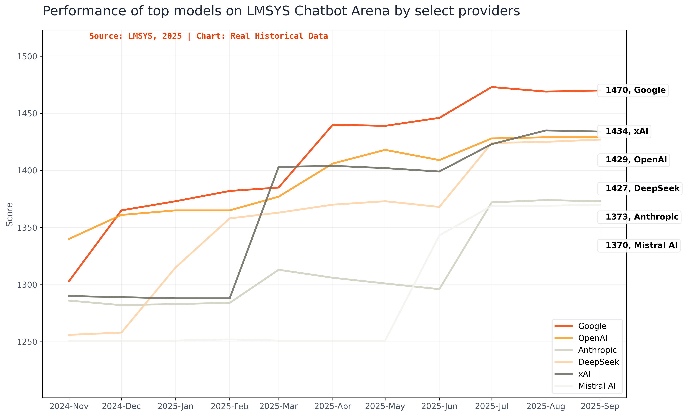

# LM Arena Leaderboard Tracker ⚡️

A data analysis and visualization project tracking the performance of top AI language models across major providers on the LM Arena leaderboard.

## Overview

This project processes and visualizes historical LM Arena leaderboard data to track how the top models from major AI providers (Google, OpenAI, Anthropic, DeepSeek, xAI, and Mistral AI) have performed over time.

## Visualizations

### Historical Performance Chart



Static chart showing the evolution of top model scores by provider from November 2024 to September 2025.

### Racing Bar Chart Animation


Animated visualization showing the competitive race between AI providers over time.

## Getting Started

### Prerequisites

- Python 3.x with pandas and matplotlib
- Node.js (for the web visualization)

### Running the Data Processor

```bash
cd lmarena_data
python process_lmarena_data.py
```

This script will:
1. Process monthly LM Arena CSV files (format: `monthly_YYYY.MM.csv`)
2. Extract the highest arena score for each provider per month
3. Generate `lmarena_top_scores_by_provider.csv` with aggregated results
4. Create a visualization chart saved as `lmarena_real_historical_chart.png`

### Running the Web Visualization

```bash
cd lmarena_web
npm install
npm run dev
```

Open [http://localhost:3000](http://localhost:3000) to view the interactive visualization.

## Project Structure

```
groqoa/
├── lmarena_data/                    # Data and processing files
│   ├── process_lmarena_data.py      # Main data processing script
│   ├── lmarena_latest.csv           # Latest leaderboard snapshot
│   ├── lmarena_top_scores_by_provider.csv  # Aggregated top scores
│   ├── lmarena_real_historical_chart.png   # Static visualization
│   └── lmarena_racing_chart.gif     # Animated visualization
└── lmarena_web/                     # Next.js visualization web app
    ├── app/
    ├── components/
    └── public/
```

## Tracked Providers

- **Google** - Gemini models
- **OpenAI** - GPT models
- **Anthropic** - Claude models
- **DeepSeek** - DeepSeek models
- **xAI** - Grok models
- **Mistral AI** - Mistral models

## Data Source

Data is sourced from the [LM Arena Leaderboard](https://lmarena.ai/), which ranks language models based on human preference voting.
